### 숙련 Spring_일정 관리 앱 Develop

### 프로젝트 소개
일정 관리를 위한 일정 API, 일정의 댓글 API, 일정과 댓글을 만드는 유저 API를 구현하였습니다.

### API 명세서
https://documenter.getpostman.com/view/37347999/2sBXVfiqtW

### ERD
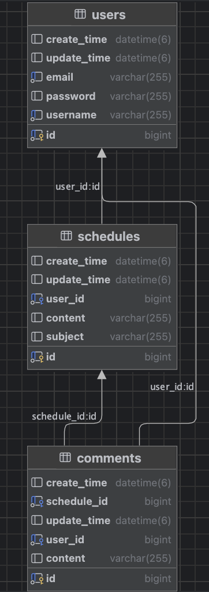

### 실행 결과
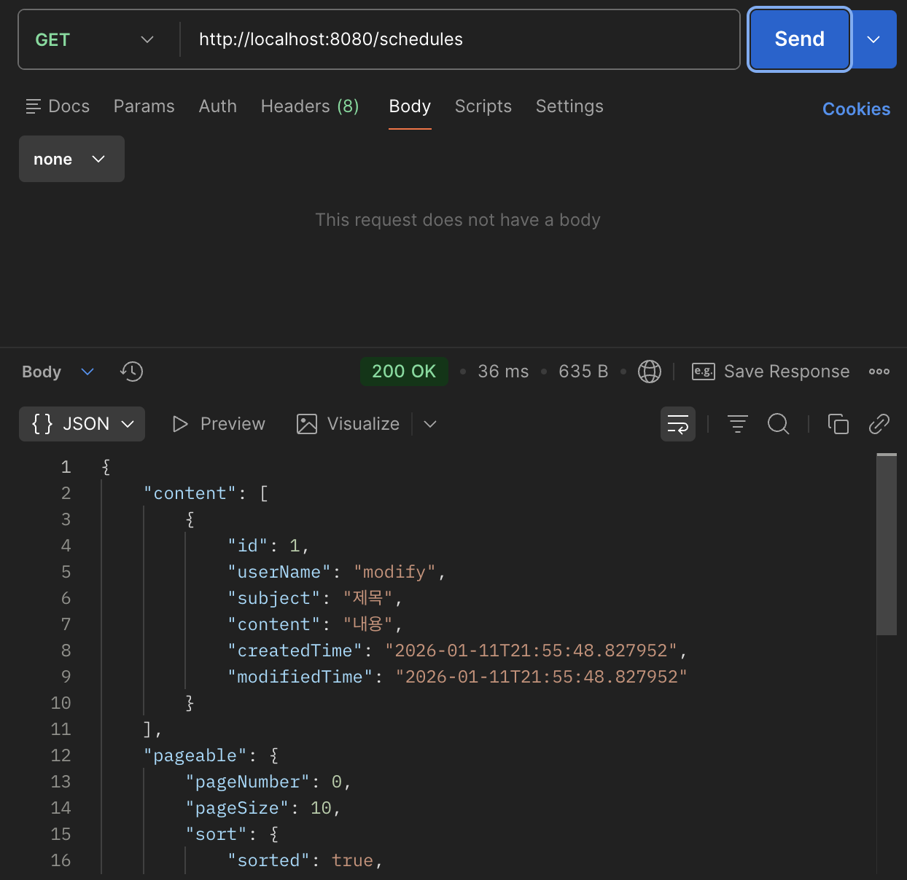
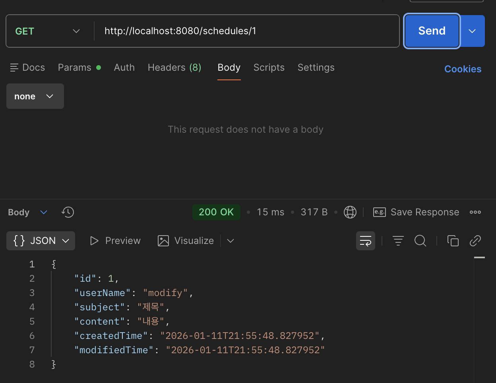
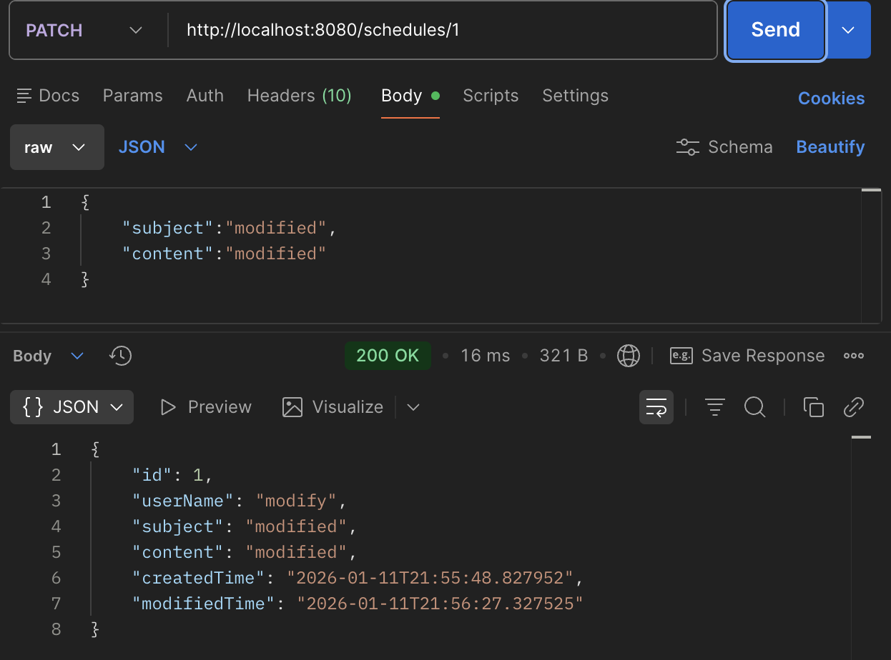
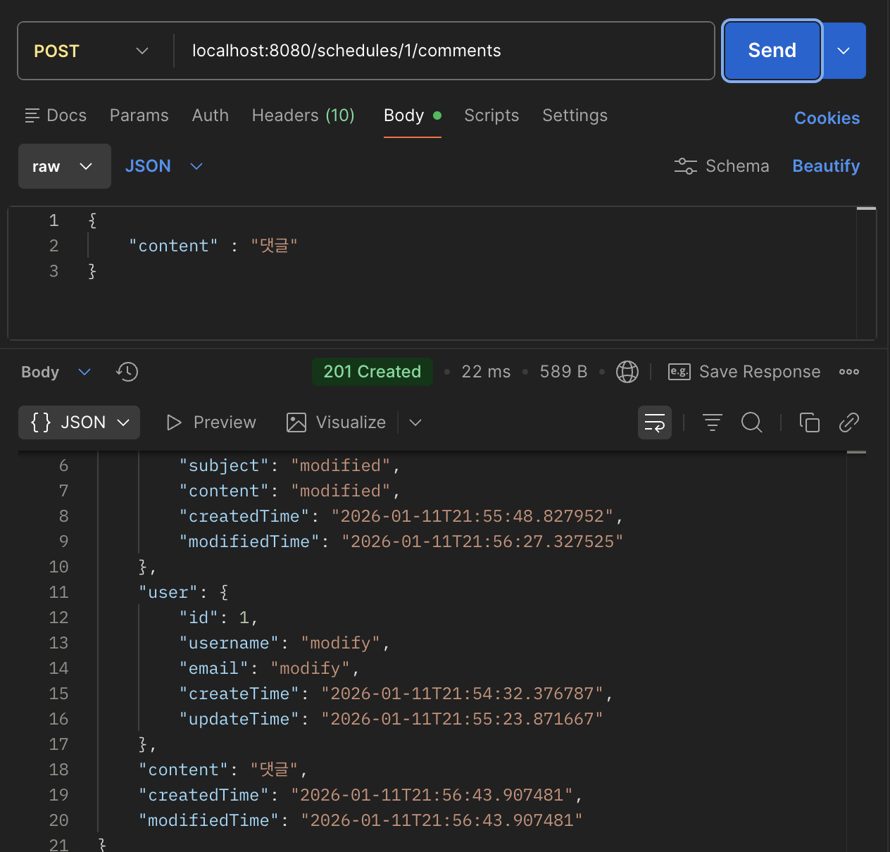
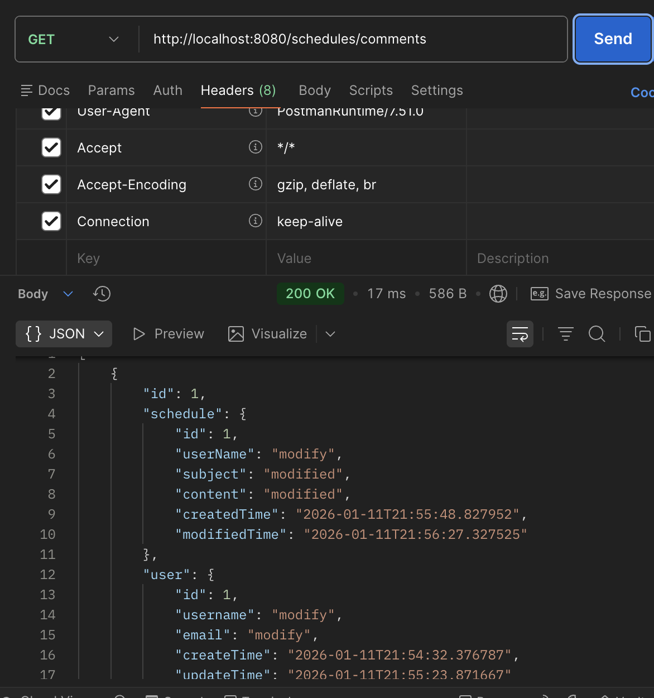
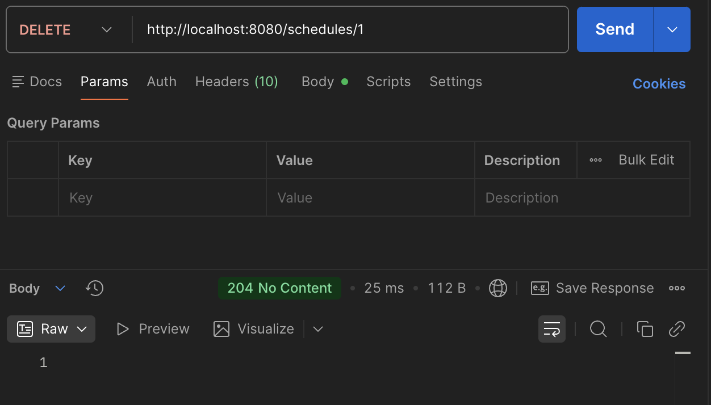
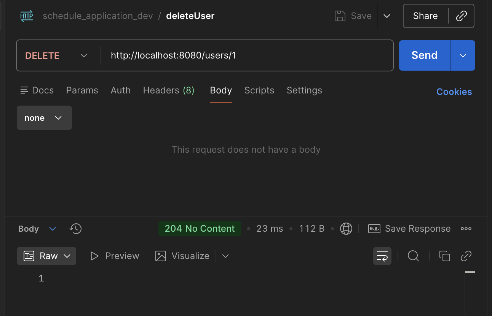
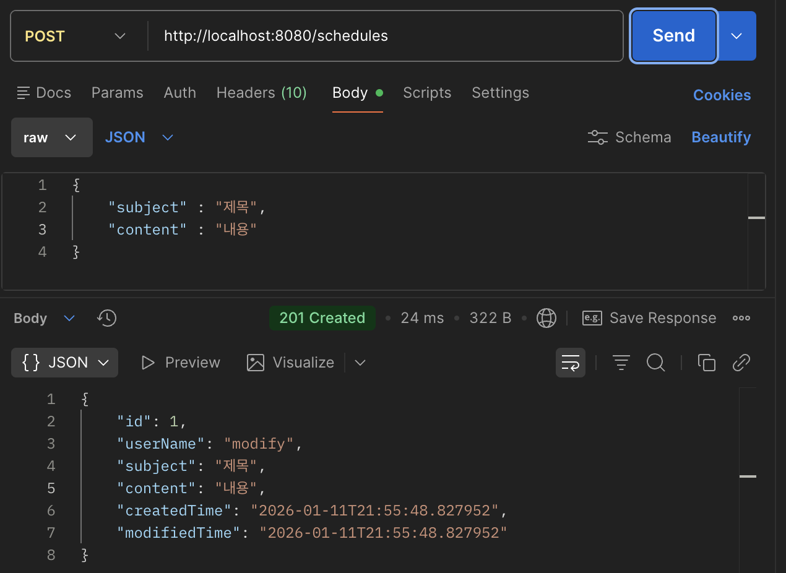
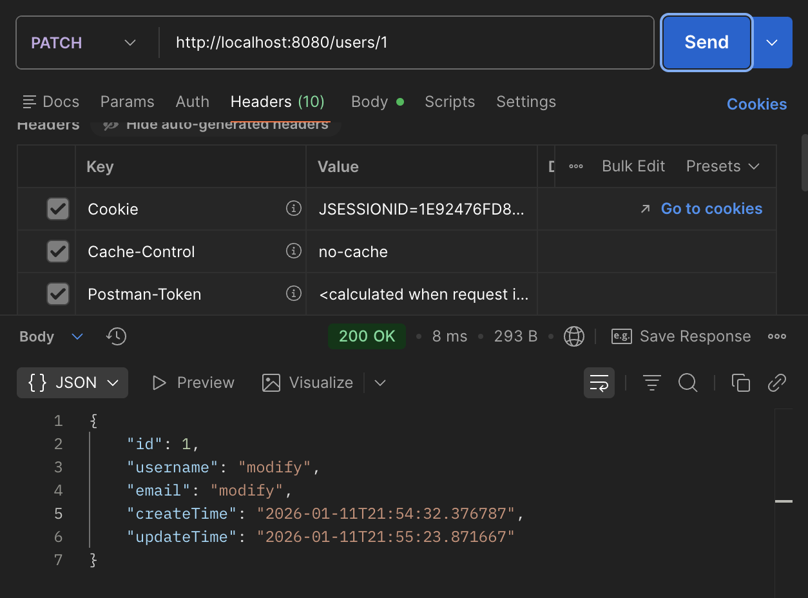
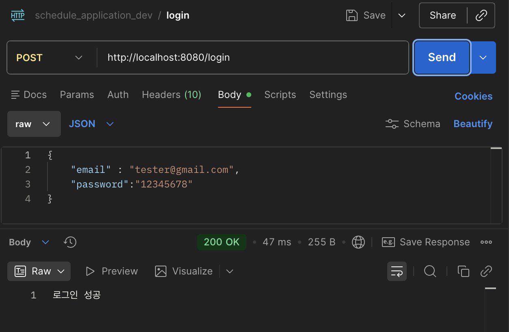
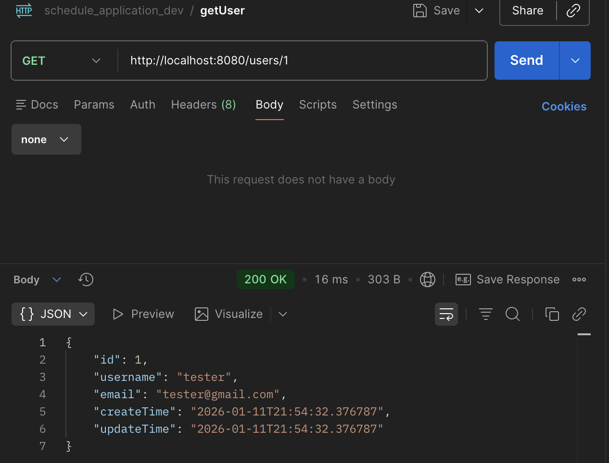
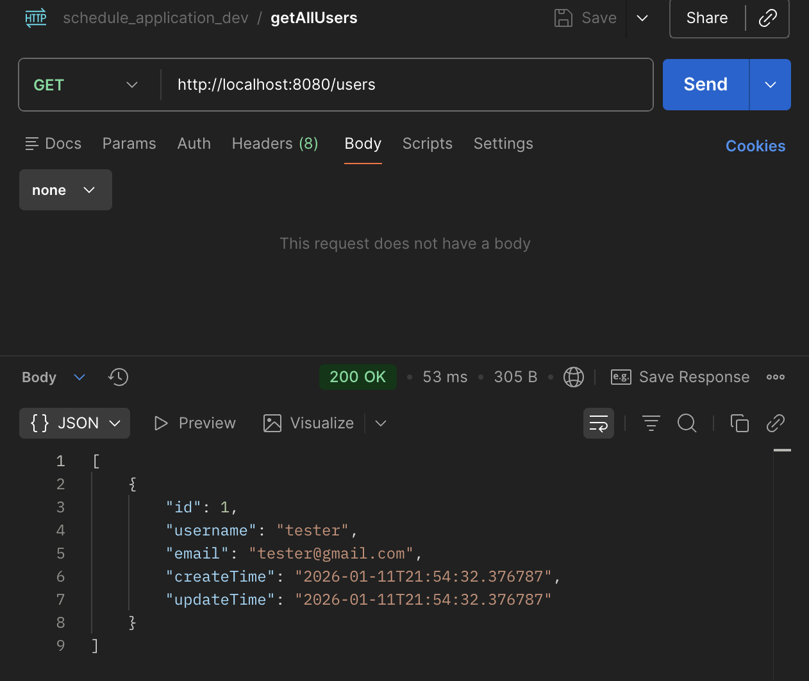
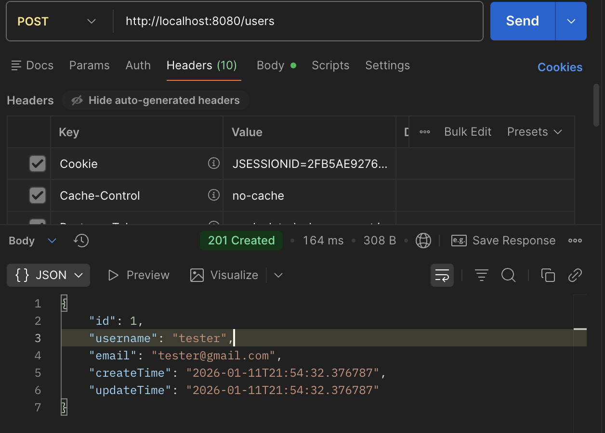

### 구현 사항
- 일정 CRUD
  - 일정 생성, 전체 조회, 단건 조회, 수정, 삭제 구현
  - 요청별로 requestDto, responseDto 사용
  - 작성일, 수정일은 JPA Auditing을 사용하여 자동적으로 채우게 함
- 유저 CRUD
  - 유저 생성, 전체 조회, 단건 조회, 수정, 삭제 구현
  - 요청별로 dto 사용
  - 작성일, 수정일은 JPA Auditing 사용
  - 한 유저가 여러 일정을 만들수 있고 일정은 유저가 없으면 존재할 수 없다. 이를 jpa 연관관계를 사용하여 표현
- 회원 가입
  - UserCreateRequestDto와 User 엔티티가 비밀번호를 가질수 있게 하고 BeanValidation을 사용하여 비밀번호가 8글자 이상이도록 함
- 로그인
  - 세션을 사용하여 로그인에 성공하면 userId를 value로 하는 세션 생성
  - 일정 API들은 항상 sessionAttribute를 확인해서 존재하지 않으면 badRequest를 반환하고 로그인 성공한 요청들만 접근할 수 있도록 함.
  - 유저와 일정 API중에서 정보를 변경, 삭제하는 요청은 sessionAttribute에서 뽑아낸 userId를 활용하여 해당 유저가 일정을 만든 유저인지 확인하거나 해당 유저가 같은 유저인지 확인 후 삭제/수정 할 수 있도록 함.
- 예외처리
  - RestControllerAdvice를 사용하여 예외처리를 용이하게 함.
- 비밀번호 암호화
  - PasswordEncoder를 사용하여 db에 저장되는 암호를 평문이 아니고 암호화된 암호를 저장하도록 함.
  - PasswordEncoder는 BCrypt를 사용하는데 BCrypt는 같은 암호를 암호화해도 다른 결과가 나오므로 matches 함수를 통해 db에 저장된 암호와 loginRequestDto를 통해 오는 암호의 일치 확인
- 댓글 CRUD
  - 댓글은 유저와 일정이 없으면 존재할 수 없으므로 이를 연관관계로 표현
  - 댓글 저장, 전체 조회 구현
- 일정 페이징 조회
  - 전체 일정을 조회하는 경우 페이징 적용

### trouble shooting
https://velog.io/@sy99/%EC%88%99%EB%A0%A8-Spring%EC%9D%BC%EC%A0%95-%EA%B4%80%EB%A6%AC-%EC%95%B1